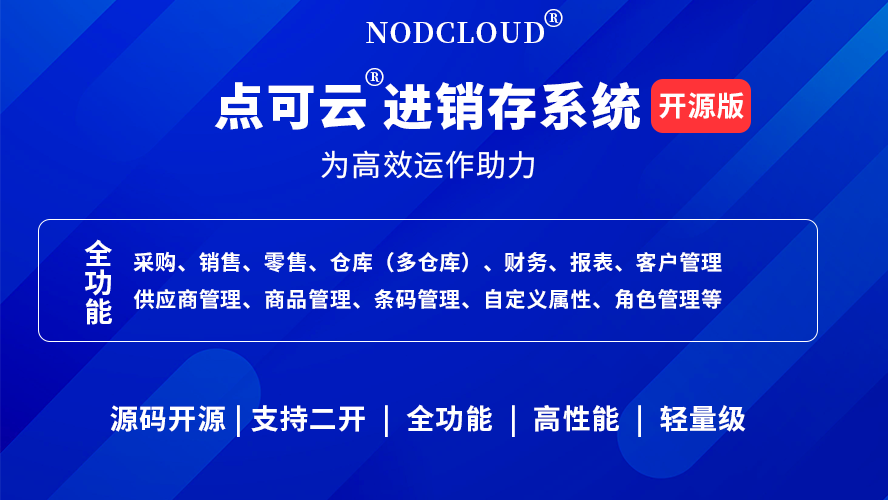
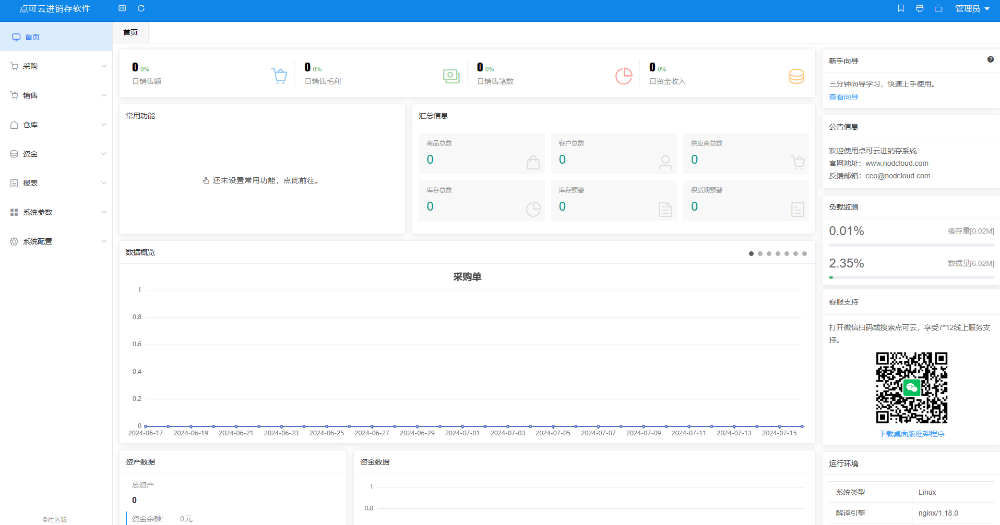
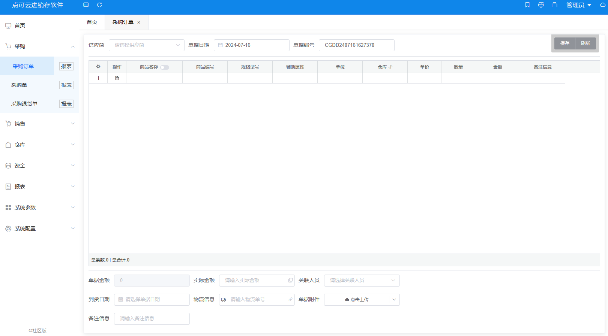
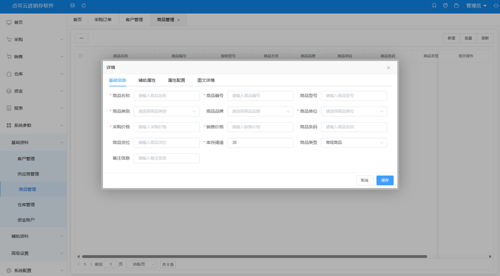
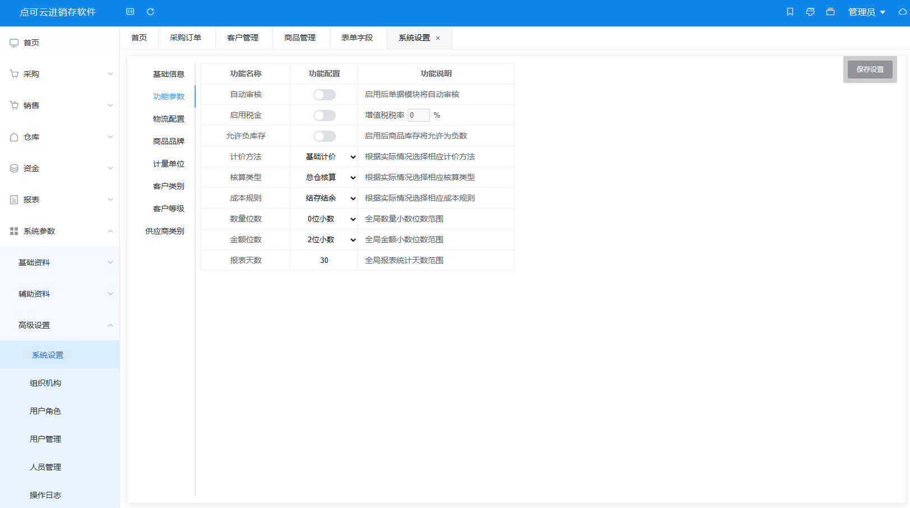

## 本源码是可以免费下载学习的，我们没有经过任何途径任何方式出售。所有收费去版权去授权的请一律不要相信！社区版免费下载就可以安装搭建！如需要商用请看下边的授权说明。

##  :smile: 如果您认为本项目对您有帮助，请点击Star，这对我们很有帮助，谢谢

#### 介绍
点可云ERP进销存系统V7社区版，基于thinkphp+vue开发。功能包含：采购、销售、零售、多仓库管理、财务管理等功能和超详细的报表功能（采购报表、销售报表、零售报表、仓库报表、资金报表等）官网地址：www.nodcloud.com 文档地址：docs.nodcloud.com

#### 软件架构
ERP进销存采用前后端分离架构，前端基于Node.js、Vue2、Element-UI，后端基于ThinkPHP6 ，它具有模块化、易扩展等特点，使得开发者可以根据自己的需求进行定制化开发

#### 演示站点
1. [演示网站](https://web.nodcloud.cn)
2. 账号 admin
3. 密码 admin

#### 运行环境
1. PHP7.3
2. mysql5.6（5.7以上版本需要关闭数据库严格模式 [视频教程](https://www.bilibili.com/video/BV1F54y1A7Vc) [文本教程](https://docs.nodcloud.com/erp/v7/com)）
3. 需配置THINKPHP伪静态

#### 文档结构
1. serve（后端代码）
2. web（前端代码）

#### 编译说明
1. 将前端代码编译后按照开发文档放置目录
2. 将放置后的后端代码上传更目录访问即可

#### 文档教程
1. [使用文档](https://docs.nodcloud.com/erp/v7/doc)
2. [开发文档](https://docs.nodcloud.com/erp/v7/dev)
3. [视频教程](https://space.bilibili.com/1914574537)

#### 社区版本
1. 社区版为原商业版本，业务逻辑完整且多次迭代。
2. 社区版仅限于学习交流用途，商用须取得授权。
3. 受三方组件授权影响，社区版未提供打印功能。
4. 受销控影响，社区版本短期内不提供零售模块。
5. [完整授权版本](https://v7.nodcloud.cn)

### 历史版本
1. V5社区版：https://gitee.com/yimiaoOpen/nodcloud-v5
2. V6社区版：https://gitee.com/yimiaoOpen/nodcloud
3. v7社区版：当前版本
3. V8商业版：https://erp.nodcloud.com

#### 商用版本
1. 商业版V8为点可云主力产品，提供长期售后支持。
2. 商业版V8为全新架构LARAVEL+VUE3，持续迭代。
2. 商业版v8支持全终端使用（安卓、苹果、小程序）。
3. [产品介绍](https://www.nodcloud.com/product/erp)
4. [演示地址](https://erp.nodcloud.com)

#### 交流群
1. 社区版QQ交流群：640974004
2. QQ交流1群：280470323
3. QQ交流2群：219813486
4. QQ交流3群：640974004
5. 在线客服 [点击查看](https://www.nodcloud.com/about#contact)
6. 客服电话：400-728-0806

### 演示截图
#### 首页

#### 单据

#### 商品

#### 系统

####  :smile: 更多功能请参阅演示站或部署查看

